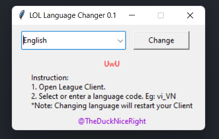
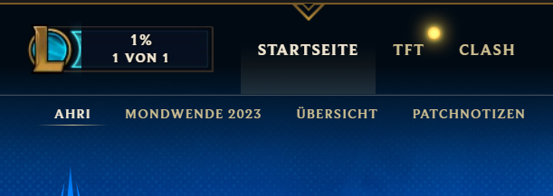

# LOL Language Changer



It's 2023 and Riot said in their 2023 season video that LOL Language option is comming at LATER OF THIS YEAR...And I was like: "How hard could it be?".

So, enjoy changing to any of these languages:

```text
en_US: English (alternatives en_GB, en_AU)
vi_VN: Vietnamese
ja_JP: Japanese
ko_KR: Korean
zh_CN: Chinese
zh_TW: Taiwanese
es_ES: Spanish (Spain)
es_MX: Spanish (Latin America)
fr_FR: French
de_DE: German
it_IT: Italian
pl_PL: Polish
ro_RO: Romanian
el_GR: Greek
pt_BR: Portuguese
hu_HU: Hungarian
ru_RU: Russian
tr_TR: Turkish
```

# Download

[Click here to download the latest version](https://github.com/ducviet321/LOL-Language-Changer/releases/latest/download/lol_language_changer.zip)

# Usage

## Windows

1. Make sure to open League Client first.
2. Open this program, select language and click "Change"!

*Note* First time selecting a new language would take ~5 minutes to download it



## Linux and macOS

```bash
# Linux
./lol_language_changer.py --wineprefix /path/to/install

# macOS native install
./lol_language_changer.py

macOS WINE install
./lol_language_changer.py --mac-wine --wineprefix /path/to/install
```

# Caveats

- The Linux client may get a bit glitchy. If the Riot Games Client launches,it should be in the selected language.
If it does not let you launch the game due to a greyed out button, simply close the Riot Client and launch League of Legends.exe normally.
The game should then load and start downloading the new language.

- The Linux client may also take a few minutes to run after the Language Changer window has closed, but the language change will still apply.

# Build

`pyinstaller --noconfirm --onefile --windowed --icon "E:/EProjects/LOL-Language-Changer/icon.ico"  "E:/EProjects/LOL-Language-Changer/lol_language_changer.py"`

# License

I actually have no idea how licensing works, so if you use it, clone it, do whatever with it, please credit to me, thank you ^3^

@TheDuckNiceRight
